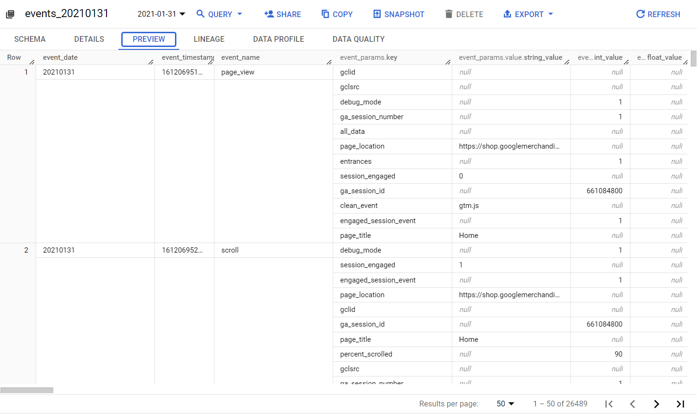
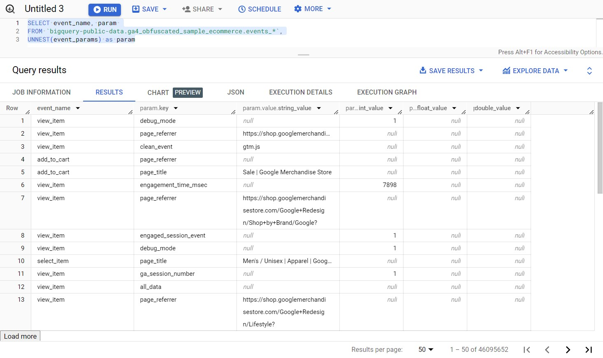
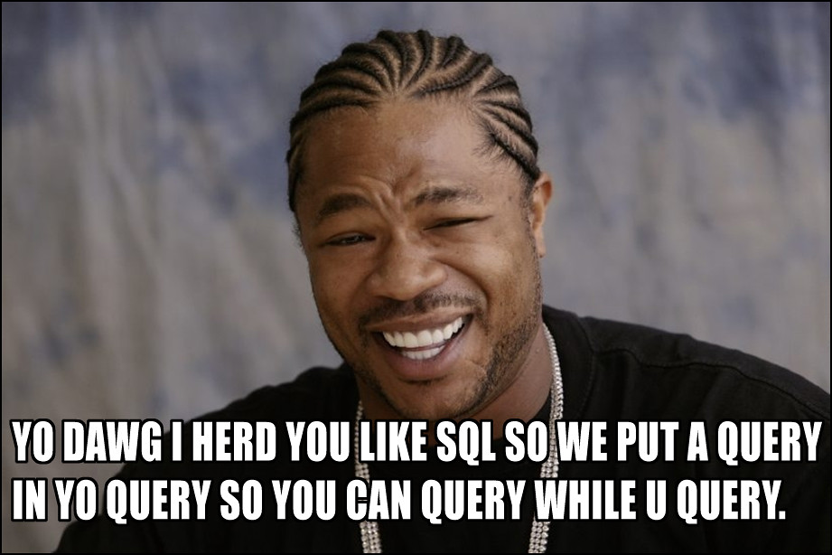
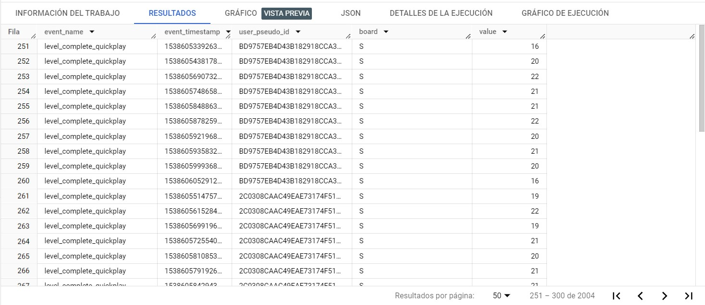

 
Una de las barreras que existe entre la versión anterior de Google Analytics y la nueva, es que la data de eventos no es tan accesible como antes. El nuevo modelo se centra solo en dos alcances: **eventos** y **usuarios**. Pese a que el modelo de GA4 es más flexible para recoger información precisa, ya no es tan accesible desde herramientas como Looker Studio.

Para obtener la data de eventos de manera tabular, es necesario emplear la función `UNNEST`. En este artículo explicaremos cómo consultar el export de datos de Google Analytics 4 hacia BigQuery para analizar los eventos y parámetros recolectados. _Let's go!_


Para seguir este artículo, debes activar la exportación de datos de Google Analytics 4 hacia BigQuery. Si no tienes una cuenta de GA4 con el export activado, puedes usar el [set de datos de prueba de GA4](https://developers.google.com/analytics/bigquery/web-ecommerce-demo-dataset) que se encuentra en BigQuery.


## ¿Por qué usar `UNNEST`?

Uno de los aspectos más complejos de trabajar con la exportación de datos es que esta hace uso de arrays para almacenar la data de eventos. Estas arrays se ven así:



Aquí es cuando entra el operador `UNNEST`. **Este operador toma las filas de un array y las convierte en columnas de una tabla**. Para efectos de este ejercicio, esto es todo lo que tenemos que saber para empezar a usarlo. La documentación de BigQuery tiene una [sección detallada sobre el operador `UNNEST`](https://cloud.google.com/bigquery/docs/arrays?hl=es-419#flattening_arrays).

Ahora que conocemos la función, debemos saber _qué desanidar_ y _cómo desanidarlo_.

## Aplicando `UNNEST` al set de datos de GA4

Si decidiéramos aplicar esta función a una tabla del export de Google Analytics 4, la consulta luciría de la siguiente manera:

```sql
SELECT * FROM `proyecto.analytics_12345689.events_*`,
UNNEST(event_params) as param
```

Lo que haría esta consulta es extraer los valores de los parámetros de _cada fila de evento_ (si, me refiero a cada registro de eventos) y extraerlos todos en una nueva columna, _repitiendo el evento al que le pertenece las veces que sea necesario_. Cómo podrás comprender, eso no es muy práctico ni barato. Por ello, necesitamos ajustar un poco la consulta, de manera que limitemos las columnas que vamos a seleccionar. La consulta empieza a tomar forma de la siguiente manera:

```sql
SELECT event_name, param 
FROM `proyecto.analytics_12345689.events_*`,
UNNEST(event_params) as param
```

El resultado de esta consulta sobre un set de datos de GA4 (en este caso, los datos de prueba de Google Shop) luce así:



Tenemos algo mucho mejor que un montón de data anidada. Hasta este punto, puedes cerrar esta página y ponerte a hacer algo mejor. Pero, ambos sabemos que si estás leyendo este post, _no tienes nada mejor que hacer_ ¯\\\_(ツ)\_/¯. Por ello, te invito a conocer la manera más útil de extraer esta data: **usando sub-consultas**.

### Usando `SELECT FROM UNNEST` dentro de una consulta de datos de BigQuery



La manera más efectiva de solucionar este problema hace uso de sub-consultas: tal cual dice Xzibit arriba, consultas dentro de una consulta. La explicación de por qué esto es así la tiene [Todd Kerpelman](https://medium.com/@kerp), quien explica en detalle por qué [el uso de SELECT FROM UNNEST](https://medium.com/firebase-developers/how-to-use-select-from-unnest-to-analyze-multiple-parameters-in-bigquery-for-analytics-5838f7a004c2) en una serie de sub-consultas es la manera más ordenada de acceder a la data de eventos de GA4.

La consulta final queda de la siguiente manera:

```sql
SELECT event_name, event_timestamp, user_pseudo_id, 
  (SELECT value.string_value FROM UNNEST(event_params) 
    WHERE key = "param1_str") AS param1_str,
  (SELECT value.double_value FROM UNNEST(event_params) 
    WHERE key = "param2_double") AS param2_double,
  (SELECT value.int_value FROM UNNEST(event_params) 
    WHERE key = "param3_int") AS param3_int 
FROM `proyecto.analytics_12345689.events_*`
WHERE event_name = "nombre_evento"
```


 Ver en GitHub


Vamos a explicar que es lo que hace esta consulta:

1. Seleccione el nombre del evento, la hora del evento y el pseudo ID del usuario. De esta manera tenemos los eventos únicos.
2. Luego, tenemos una sub-consulta por cada parámetro a analizar. Si ven el resultado de la consulta anterior, los parámetros se desanidan en 3 columnas, correspondientes al tipo de dato que almacenan: `string`, `double` o `integer`. Debido a que las arrays de BigQuery solo almacenan un tipo de dato en cada valor, se necesitan de las tres columnas. De ahí surge la necesidad de llamar `value.string_value`, `value.double_value` o  `value.int_value` según corresponda.
3. La tabla se escoge mediate la cláusula `FROM`. Aquí va el ID de la tabla de tu export de GA4.
4. Finalmente, tenemos que seleccionar el nombre del evento que queremos analizar, usando una cláusula `WHERE`.

### Probando la consulta

Con esta consulta, seremos capaces de aplanar un evento y los parámetros que deseemos. La clave está en ordenar la consulta para saber _qué_ se está aplanando. Al aplicar la lógica de esta consulta a la muestra de eventos de GA4 de la aplicación Flood It!, obtenemos el siguiente resultado:

```sql
SELECT event_name, event_timestamp, user_pseudo_id, 
  (SELECT value.string_value FROM UNNEST(event_params) 
    WHERE key = "board") AS board,
  (SELECT value.int_value FROM UNNEST(event_params) 
    WHERE key = "value") AS value,
FROM `firebase-public-project.analytics_153293282.events_20181003`
WHERE event_name = "level_complete_quickplay"
```



Bien, ahora que ya sabemos cómo podemos extraer esta data de eventos, podemos calcular promedios, desviaciones estándar y utilizar esta data a nuestro antojo. Incluso, podemos llevárnosla a Looker Studio, pero ese es un tema para otro día.
